# System Architecture Diagram

This document contains a visual representation of the Nexus Hub system architecture.

## Architecture Overview

The system follows a **microservices architecture** with clear separation of concerns:

- **Nexus Hub Service**: 
  - **FastAPI Application Layer**: HTTP API endpoints (e.g., `POST /messages/inbound`), middleware, authentication, rate limiting
  - **Message Processing Core**: Business logic for message processing, LLM orchestration, and tool execution (separate from API layer)
- **Channel Adapter Services**: Separate services that handle channel-specific protocols and convert to/from the canonical message format
  - **Telegram Adapter**: Currently implemented for testing/development purposes only
  - **Web/API Adapter**: Direct API clients
  - **Other Adapters**: Slack, Email, etc. (future implementations)

All channel adapters communicate with the orchestrator via the standard `POST /messages/inbound` API endpoint (part of the FastAPI application layer), which then delegates to the message processing core. This ensures the orchestrator remains channel-agnostic and the API layer is separated from core business logic.

## High-Level System Flow

## Component Interaction Sequence

## Data Flow Architecture

## Infrastructure Components

## Tool Execution Flow

## Database Schema Relationships

```mermaid
erDiagram
    TENANTS ||--o{ CHANNELS : "has"
    TENANTS ||--o| TENANT_PROMPTS : "has"
    TENANTS ||--o{ TENANT_TOOL_POLICIES : "has"
    TENANTS ||--o{ KNOWLEDGE_BASES : "has"
    TENANTS ||--o{ MCP_SERVERS : "has"
    TENANTS ||--o{ CONVERSATIONS : "has"
    TENANTS ||--o{ MESSAGES : "has"
    TENANTS ||--o{ EVENT_LOGS : "has"
    TENANTS ||--o{ TOOL_CALL_LOGS : "has"
    TENANTS ||--o{ LLM_TRACES : "has"
    TENANTS ||--o{ API_KEYS : "has"
    
    CHANNELS ||--o{ CONVERSATIONS : "has"
    CONVERSATIONS ||--o{ MESSAGES : "contains"
    
    TOOLS ||--o{ TENANT_TOOL_POLICIES : "referenced_by"
    
    TENANTS {
        uuid id PK
        string llm_provider
        string llm_model
        string isolation_mode
    }
    
    CHANNELS {
        uuid id PK
        uuid tenant_id FK
        string channel_type
        boolean is_active
    }
    
    CONVERSATIONS {
        uuid id PK
        uuid tenant_id FK
        uuid channel_id FK
        string external_thread_id
        string status
    }
    
    MESSAGES {
        uuid id PK
        uuid tenant_id FK
        uuid conversation_id FK
        string direction
        jsonb content_text
        jsonb metadata
    }
    
    TOOLS {
        uuid id PK
        string name
        string provider
        jsonb parameters_schema
    }
    
    TENANT_TOOL_POLICIES {
        uuid id PK
        uuid tenant_id FK
        uuid tool_id FK
        boolean is_enabled
        jsonb config_override
    }
```

## Channel Adapter Architecture

### Channel Adapter Responsibilities

Channel adapters are **separate services** that:

1. **Receive channel-specific messages** (webhooks, API calls, etc.)
2. **Transform to CanonicalMessage format** (normalize channel-specific data)
3. **Call Orchestrator API** (`POST /messages/inbound`) with API key authentication
4. **Receive outbound CanonicalMessage** from orchestrator
5. **Transform back to channel format** and send response

### Key Design Principles

- **Separation of Concerns**: Channel-specific logic stays in adapters, not in orchestrator
- **Channel Agnostic**: Orchestrator only knows about `CanonicalMessage`, not channel specifics
- **Standardized Interface**: All adapters use the same `POST /messages/inbound` endpoint
- **Independent Deployment**: Adapters can be deployed, scaled, and updated independently
- **Testing Support**: Telegram adapter currently serves as a testing/development tool

